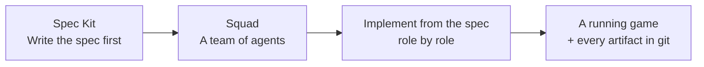

# Squad with Spec-Driven Development & Spec Kit 

Build a working app the way modern AI teams do it: **write the spec first, then let a
team of AI agents implement it.** In about an hour you'll go from an empty folder to a
playable **Rock-Paper-Scissors CLI game in Python**, without pre-built code, and
without writing the code yourself.

> **You only ever type commands and prompts.** Everything else (the spec, the plans,
> the tasks, the code, and the AI team itself) is **created live** as you run through
> the exercises. Nothing in this workshop is prepared in advance.

---

## What you'll build

An interactive **Rock-Paper-Scissors** game that runs in the terminal: you type your
move, the computer picks one, it shows the result and a running score, and you keep
playing until you quit.

## What you'll learn

| Concept | In one sentence |
|---|---|
| **Spec-Driven Development (SDD)** | Decide *what* to build and *why* (and how you'll know it's done) **before** any code exists. |
| **Spec Kit** | GitHub's open-source tool that walks you through the spec in ordered phases: constitution → specify → plan → tasks → implement. |
| **Squad** | A team of role-based AI agents that live in your repo and build *from* the spec: a planner, a spec expert, an implementer, a tester, and more. |

## The big idea



Instead of one chatbot doing everything, you assemble a small **team**. One agent owns
the Spec Kit workflow; the others follow the artifacts it produces and never skip
ahead: no planning before specs exist, no code before tasks exist.

---

## The three concepts in 60 seconds

**Spec-Driven Development** means the specification is the source of truth, not the
code. You define behavior, scope, and "done" up front, so people (and agents) don't
each fill the gaps differently. It isn't waterfall: the spec is *living*. When you
find a gap, you change the spec first, then the code.

**Spec Kit** turns that idea into four ordered files, each answering one question:

| Artifact | Question it answers | Plain meaning |
|---|---|---|
| `constitution` | What rules always hold? | Guardrails the whole project must respect |
| `spec` | What & why? | The behavior you want and the reason for it |
| `plan` | How? | The technical approach |
| `tasks` | In what steps? | An ordered, checkable to-do list |

It's **phase-gated**: you finish one phase before starting the next. That ordering is
the whole point: it stops you coding before intent is clear.

**Squad** is a coordinated team of specialist agents that live as files in `.squad/`.
Each agent has a **charter** (who they are and what they own), work is **routed** by
role, and durable **decisions** are written back to the repo, so the team is fully
inspectable and persists across sessions.

---

## Prerequisites

You need very little. The workshop installs the rest as you go.

- A **GitHub account with GitHub Copilot** enabled.
- A place to run a terminal. **GitHub Codespaces is recommended** (browser-based,
  nothing to install locally); a local macOS/Linux/Windows terminal works too.
- Basic comfort running commands in a terminal. **No Python or AI experience needed.**

Everything else (the latest Copilot CLI, the Squad CLI, `uv`, and Spec Kit) is
installed in **Steps 1–5** of the walkthrough.

### Prerequisites check

This workshop runs in a **GitHub Codespace** (or any terminal) and builds on three
tools: the **GitHub Copilot CLI**, **npm** (Node.js), and **uv** (Python). Before
Step 1, confirm what you already have. 🖥️ **Terminal:**

```bash
copilot --version
npm --version
uv --version
```

**What this does:** prints the version of each tool if it's installed. In a fresh
Codespace, the Copilot CLI and npm are normally already there; `uv` often isn't yet.
Don't worry if one is missing, the early steps install it:

| Tool | Why you need it | If the check fails |
|---|---|---|
| **GitHub Copilot CLI** | Runs the Squad coordinator and your agents | **Step 1** installs or upgrades it |
| **npm** (Node.js) | Installs the Squad CLI | Codespaces ships it by default; otherwise install Node.js (npm is included) |
| **uv** (Python) | Runs Spec Kit and your game | **Step 4** installs it |

Once the three checks run, continue to Step 1.

---

## How this workshop works

You'll do two kinds of thing, and the guide always tells you which:

| Marker | Where you type it | Example |
|---|---|---|
| 🖥️ **Terminal** | Your shell (Codespaces terminal) | `squad init` |
| 💬 **Squad** | Inside the running Copilot session | `Who is on the team?` |

Two habits make it smooth:

1. **Nothing is pre-built.** Each command and prompt *creates* something: a config
   file, a charter, a spec, real game code. Take a moment to open what gets created;
   the guide points out what to look at.
2. **You stay in control.** Agents propose; you approve. When Copilot asks to run a
   tool or write a file, you decide. (Step 7 shows how to auto-approve for the workshop.)

---

## Workshop at a glance

| Phase | Steps | What happens |
|---|---|---|
| **1 · Set up** | 1–5 | Update Copilot, install Squad + `uv`, initialize Squad and Spec Kit |
| **2 · Assemble the Squad** | 6–7 | Launch the Squad, create the team, tour the files it generates |
| **3 · Build & run** | 8–9 | The team drives Spec Kit and builds the game; you play it |
| **4 · Extend** | 10–11 | Add a score-counter feature, then add a brand-new team role |

---

## Start here

Open **[WORKSHOP.md](WORKSHOP.md)** and follow the steps in order.

> **Heads-up: these tools move fast.** Squad and Spec Kit are early and evolve
> quickly, and the exact agent names, models, and file details you see may differ
> slightly from the examples here. When in doubt, trust what the live tool prints
> over this handout. The *flow* stays the same.

---

## Resources

The two tools this workshop is built on, straight from the source:

- **Squad**: [bradygaster.github.io/squad](https://bradygaster.github.io/squad/)
- **Spec Kit**: [github.github.com/spec-kit](https://github.github.com/spec-kit/)
- **Community**: [github.com/github/spec-kit/discussions](https://github.com/github/spec-kit/discussions)
- **Extentions**: [SpecKit Community Extensions](https://speckit-community.github.io/extensions/)
